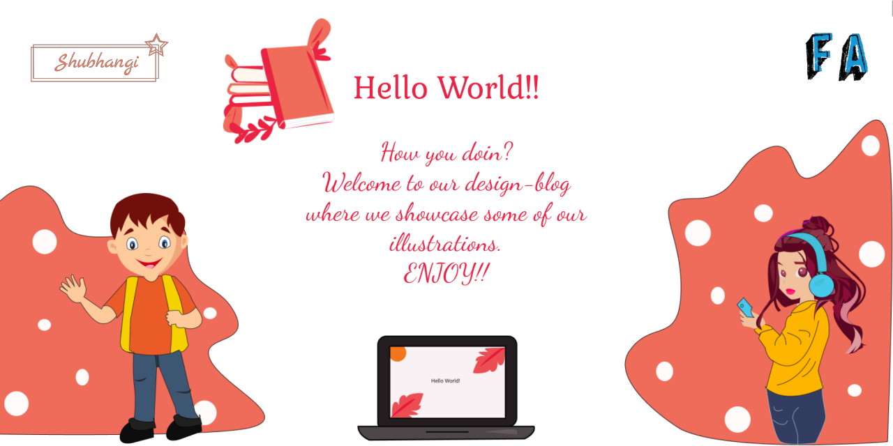

# Our Illustrations

This is a collaboration over some illustrations we both designed while being stuck at home during the corona-virus lockdown. We designed these while learning adobe illustrator basics. We used photoshop for some of the tweaks and changes too.

One evening we were talking about showcasing these learning bits of arts, so we decided to host it on github. Then we thought some like-minded people might also like to collaborate over this so we open sourced the code and the project here. So, we are open to collaborations here. (See [contributing](#contributing) for more details)

## Techstack

### Illustrations


### Web Interface


### External Libraries
None

## Contributing

Fork this repository and add SVGs to ``SVGs/`` and AI files to ``AIs``. Also, add your illustration details in ``assets/files.json`` in the following format:
```JSON
{
     "id" : "n+1",
    "src" : "My-Design.svg",
   "auth" : "My-Name",
   "date" : "2020-06-01 22:30:00",
   "tags" : [ "art", "illustration" ]
}
```

- In ``id``, n being the id of last input
- In ``src``, name of your SVG file saved in ``SVGs/`` directory
- In ``auth``, your name
- In ``date``, time when you made final changes to your design ``[YYYY-MM-DD HH:MM:SS in 24-hr format]``
- In ``tags``, at most 10 tags related to the design

Then, send a pull request to this [repository](https://github.com/goyalshubhangi/designing). If you have any issues regarding anything, you can open an issue here. We would love collaborations.:sparkling_heart:

## Heyy, it's us :wave:</h2>
<p align="center">
  &emsp;
  &emsp;
  
</p>
<p align="center">
  <a href="https://goyalshubhangi.github.io"></a>
</p>

<p align="center">
  &emsp;
  &emsp;
  
</p>
<p align="center">
  <a href="https://faisalakhtar.github.io"></a>
</p>

## Licensing

### Assets
All art assets (files in ``SVGs/``, ``AIs/`` and ``assets/img/``) are distributed under the [Creative Commons Attribution 4.0 International](http://creativecommons.org/licenses/by/4.0/) license.

### Code
All scripts, stylesheets and markups are distributed under the [MIT](License-MIT.md) license.
